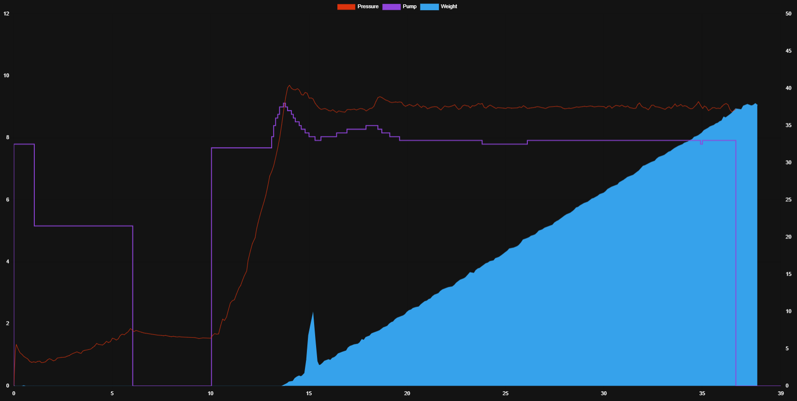

# chartjs-card

[](https://github.com/ricreis394/chartjs-card/releases/latest)
[](https://github.com/hacs/integration)

ESPresso Chart.js card for Home Assistant
Used for a specific modification to make a smart espresso maker using EspHome

## [Chart.js 4.X documentation](https://www.chartjs.org/docs/)



## Instalation through HACS

This card isn't in HACS, but you can add it manually through `Custom repositories`

To do that just follow these steps: **HACS -> Frontend -> 3 dots (upper right corner) -> Custom repositories -> (Paste this github page url)**

## Config

| Name           | Type    | Default | Description                                                        |
| -------------- | ------- | ------- | ------------------------------------------------------------------ |
| chart          | string  |  scater | Can't be changed                                                   |
| updateinterval| float   | 0       | Minimal pause between updating the interval. default update is on every shot timer change|
| data           |         |         | just like chart.js documentation, accepts Templates for all fields |
| options        |         |         | just like chart.js documentation                                   |
| plugins        |         |         | just like chart.js documentation                                   |
| entitiy_row    | boolean | false   | if is entity row or not                                            |
| custom_options | object  |         | TODO                                                               |
| register_plugins | array  |         | registers plugins to be added to graph                            |


## Additional plugins

Should be added (on the todo list)

| Name | Link |
|--|--|
| zoom | [https://www.chartjs.org/chartjs-plugin-zoom/latest/](https://www.chartjs.org/chartjs-plugin-zoom/latest/) |
| annotation | [https://www.chartjs.org/chartjs-plugin-annotation/latest/](https://www.chartjs.org/chartjs-plugin-annotation/latest/) |

To use the plugins you need to register before using, to do that add the name into `register_plugins` like so:

```yaml
register_plugins:
  - zoom
  - annotation
```

## Examples

### example 1


```yaml
type: custom:espresso-chartjs-card
entities:
  last_graph: input_datetime.espresso_last_graph
card_mod:
  style: |
    ha-card {
      height: 100%;
    }
data:
  datasets:
    - label: Pressure
      xAxisID: x-axis-1
      yAxisID: y-pressure
      backgroundColor: "#db330d"
      borderColor: "#db330d"
      data:
        - x: 0
          "y": 0
      showLine: true
      pointRadius: 0
      fill: false
      borderWidth: 1
    - label: Pump
      xAxisID: x-axis-1
      yAxisID: y-pumpvalue
      backgroundColor: "#9044db"
      borderColor: "#9044db"
      data:
        - x: 0
          "y": 0
      showLine: true
      pointRadius: 0
      fill: false
      borderWidth: 2
    - label: Weight
      xAxisID: x-axis-1
      yAxisID: y-gramm
      backgroundColor: "#36A2EB"
      borderColor: "#36A2EB"
      data:
        - x: 0
          "y": 0
      showLine: true
      pointRadius: 0
      fill: true
options:
  maintainAspectRatio: false
  plugins:
    title:
      display: false
      text: Shot Data
  animation:
    duration: 0
  elements:
    line:
      tension: 0
  scales:
    x-axis-1:
      position: bottom
      min: 0
      max: 15
    y-gramm:
      display: true
      position: right
      min: 0
      suggestedMax: 50
      grid:
        drawOnChartArea: false
    y-pressure:
      display: true
      position: left
      min: 0
      max: 12
      grid:
        drawOnChartArea: true
    y-pumpvalue:
      display: false
      position: left
      min: 0
      max: 100
      grid:
        drawOnChartArea: false

```

## How to make the dist file

Clone the rep to your local folder
Install NPM and use NPM to install rollup

Install dependencies: 

```bash
npm install @rollup/plugin-commonjs @rollup/plugin-json @rollup/plugin-node-resolve rollup-plugin-serve prettier install --save-dev

run: npm run rollup
```